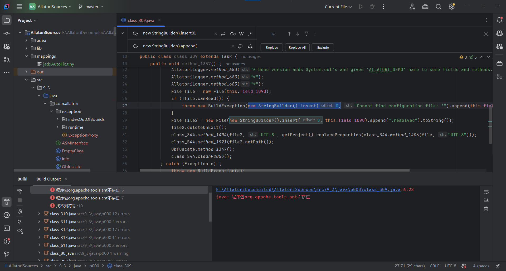
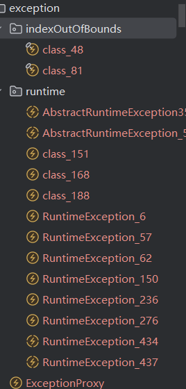

# Allatori Sources

You can found [allatori java obfuscator]()'s ~~decompiled~~ source code here

Fun facts:
 - Best String Encryption
 - Exception Master

Special thanks:
 - [Java Deobfuscator](https://github.com/java-deobfuscator/deobfuscator) very old but still can decrypt strings obfuscated by allatori 9.3
 - [Diobfuscator](https://github.com/narumii/Deobfuscator) for InlineConstantValuesTransformer and IiIiIiIiIi remapper
 - [Jadx-GUI](https://github.com/skylot/jadx) for the main reverse engineering support
 - [SmarDec INC](http://www.smardec.com/about.html) create this shit
 - [JetBrains S.R.O](https://www.jetbrains.com/idea/download/?section=windows) for the IntelliJ IDEA community edition